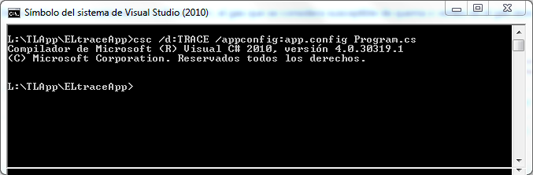
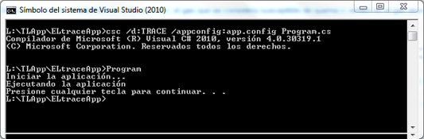
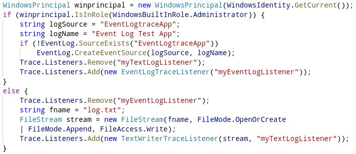
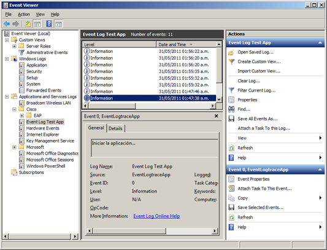

# Utilziando Logging en Aplicaciones .NET

El logging es un proceso recomendado durante la etapa de pruebas e indispensable durante la etapa de liberación o puesta en producción de aplicaciones de software, logging se refiere a la utilización de una bitácora, registro o log, donde guardemos la información de los diferentes eventos que genero la aplicación entre el tiempo de arranque y durante el tiempo de ejecución.
El registro o log debe proporcionarnos toda información necesaria para realizar con la aplicación las siguientes actividades:

<ol>
<li>Mantener el rastro de todos sus estados (recording)</li>
<li>Depurar (debugging)</li>
<li>Auditar (audit)</li>
<li>Diagnosticar su estado actual (tracing)</li>
</ol>

Un factor importante a considerar durante el logging es el performance de la aplicación ya que es un hecho que se incrementará el tiempo de las operaciones de escritura, sobre todo si el logging es requerido para una auditoría, este incremento en el performance se explica de la siguiente manera:

<i>
Si una operación del proceso de negocio emplea 5 segundos para ejecutarse y producir un resultado, con el logging necesitará 2 o 3 segundos adicionales para registrarse en el log, por lo que ahora el tiempo es de 7 u 8 segundos para el total de la operación.
</i>

El siguiente fragmento de código ilustra este factor:

<pre>
	try
	{
		//operación de negocio 5 segs.
		var output = BussinessObject.ExecuteOperation();
		//registro en el log 3 segs.
		Logger.WriteLine(output);
		//El tiempo  total de la transacción es de 8 segs.
	}
	catch(Exception e)
	{
		//No está incluído dentro de la transacción.
		Logger.WriteLine(e.Message);
	}
</pre>

Hay muchas formas de implementar logging en las aplicaciones, esto varía dependiendo del tipo de aplicación y del requerimiento a satisfacer la forma más sencilla es mediante el uso de las clases contenidas en el ensamblado System.Diagnostics. específicamente con las implementaciones derivadas de la clase TraceListener las cuales son responsables de desplegar o de guardar los mensajes generados por las clases Trace y Debug, hay tres implementaciones de esta clase:

<ol>
<li>TextWriterTraceListener escribe mensajes a cualquier clase que se derive de Stream</li>
<li>EventLogTraceListener escribe los mensajes a el Event Viewer de Windows.</li>
<li>DefaultTraceListener escribe los mensajes a la ventana de salida (Output window).</li>
</ol>

Este ejemplo muestra el uso de TextWriterTraceListener y EventLogTraceListener, la lógica del programa es simple, si el programa tiene permisos administrativos usará el event viewer como log, de lo contrario usará un archivo de texto, realizando un intercambio entre los Tracelisteners: <b>EventLogTraceListener</b> y <b>TextWriterTraceListener</b> respectivamente.

Al compilar el listado se debe de incluir la opción /d:TRACE como se muestra en la siguiente imagen:

Al ejecutar el programa mostrará un resultado como en la siguiente imagen:

Con el siguiente código el programa intercambia entre Listeners dependiendo si pertenece al grupo con permisos de administración o no.

Si no pertenece al grupo de administradores utiliza como log un archivo de texto log.txt caso contrario utiliza el Event Viewer (visor de eventos de Windows) como se muestra en la siguiente imagen:

Lo más recomendable para el logging es la utilización de componentes como el Logging Application Block de Microsoft o el Log4net de la fundación Apache.

